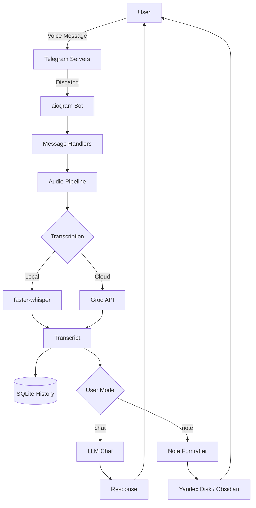
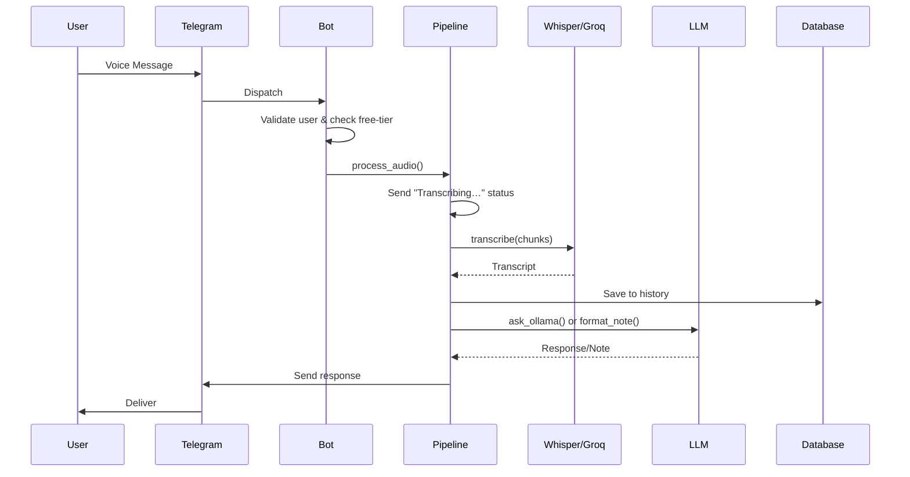

# Project Summary

## 1. Architecture Overview

The system is a Python Telegram bot that transcribes voice/audio messages and processes them through an LLM. It's structured in four clean layers:

**Interface Layer** sits at the top: an aiogram 3 Telegram bot (polling-based, all message handlers) and a FastAPI web app (serving a REST API for settings, both running inside the same process via uvicorn). Caddy reverse-proxies API requests to the bot.

**Application Layer** is the orchestration core. Three pipelines — `audio.py`, `text.py`, `youtube.py` — coordinate the full request lifecycle. Supporting modules handle conversation history (with a 20-message rolling window), per-user state (active tasks, mode, language), user settings, free-tier tracking, and OAuth state.

**AI & External API Layer** is where the actual work happens. `groq_client.py` handles transcription via either local faster-whisper or the Groq cloud API, splitting audio into 5-minute chunks before processing. `llm_client.py` / `llm_operations.py` are OpenAI-SDK-compatible clients pointing at OpenRouter by default (configurable per-user to any OpenAI-compatible endpoint). `youtube.py` wraps yt-dlp for YouTube download and optional speaker diarization. `yandex_client.py` handles OAuth2 flow for Yandex.

**Storage Layer** uses SQLite via SQLAlchemy Async as the primary store (users, settings, conversation history, OAuth tokens, free-tier counters, and a bot-message deletion tracker), Redis for pub/sub and SSE streaming (used in the OAuth callback flow), Yandex Disk via WebDAV for Obsidian vault sync, and Google Docs API for the optional "savedoc" mode.

## 2. Data Flow — Voice → Description

1. A voice message arrives at Telegram servers and is dispatched by aiogram to `handle_voice()` in `messages.py`.

2. The handler validates the user (allowlist check), checks the free-tier counter (limit = 3 uses), downloads the audio file URL via `bot.get_file()`, then spawns `process_audio()` as a tracked `asyncio.Task` stored in `active_tasks` (enabling `/stop` cancellation).

3. Inside `process_audio()`, the pipeline sends a "Transcribing…" status message, downloads the binary to a temp file, and calls `transcribe()`.

4. `transcribe()` splits the audio into 5-minute chunks (via `split_file`), then iterates: either runs local faster-whisper inference in a thread executor or calls the Groq `/audio/transcriptions` endpoint, reassembling the parts into a full transcript.

5. The transcript is saved to conversation history in SQLite, then the pipeline branches on the user's mode:
   - **chat mode**: `ask_ollama()` sends the full conversation history to the LLM and gets a response, which is also persisted.
   - **note mode**: `format_note_ollama()` sends the `NOTE_PROMPT`, parses the structured response (TITLE / TAGS / body), builds a Markdown note, and uploads it to Yandex Disk via WebDAV (Obsidian vault sync).

6. The final text is sent back to the user via `message.answer()`.

## 3. Key Components

- **`bot.py`** — Process entry point: creates the Bot and Dispatcher, registers all routers, runs aiogram long-polling and uvicorn concurrently via `asyncio.gather`.

- **`interfaces/telegram/handlers/messages.py`** — Routing hub: handles voice, audio, video note, document, video, and text messages, delegating each to the right pipeline.

- **`application/pipelines/audio.py`** — Most complex pipeline: coordinates download, transcription, mode branching, and note formatting with optional Obsidian save.

- **`infrastructure/external_api/groq_client.py`** — Transcription engine: abstracts local Whisper vs. Groq API behind a single `transcribe()` function with a status_callback for live progress updates.

- **`infrastructure/external_api/llm_client.py`** — Provides `ask_ollama()` (stateful chat with history) and `summarize_ollama()` / `format_note_ollama()` (stateless one-shot prompts).

- **`infrastructure/database/database.py`** — Facade delegating to four repos: `UserRepo`, `ConversationRepo`, `OAuthRepo`, and `BotMessageRepo`.

- **`infrastructure/storage/obsidian.py`** — Handles the full WebDAV lifecycle: folder creation (MKCOL), collision-safe filename generation, and token refresh.

- **`interfaces/webapp/`** — FastAPI app with auth via Telegram's initData HMAC validation.

- **Caddy** — Reverse-proxies `/api/*` to FastAPI.

## 4. System Architecture Flowchart

## 5. Message-to-Description Sequence

## 6. Notable Design Decisions

**Single-process dual-server**: `bot.py` runs aiogram polling and uvicorn inside the same `asyncio.gather()`. This means the Telegram bot and the FastAPI Mini App backend share one process and one event loop — convenient but means a heavy transcription task can affect API latency.

**Per-user LLM client caching**: `llm_client.py` caches `AsyncOpenAI` instances keyed on `(api_key, base_url)` — users can bring their own OpenRouter/Ollama endpoint without paying the client-init overhead on every message.

**Direct network access**: The bot connects directly to external APIs (Telegram, Groq, OpenRouter) via the host's primary network interface without an internal proxy layer.

**Free tier with shared credentials**: `can_use_shared_credentials()` in `state.py` gates users without a personal API key to 3 free uses, after which they must supply their own key via the Mini App settings.

**Message tracking for /clear**: `BotMessageRepo` records every bot and user message ID within a 48-hour window, enabling `/clear` to bulk-delete the conversation from the Telegram chat using the `delete_messages` API.
